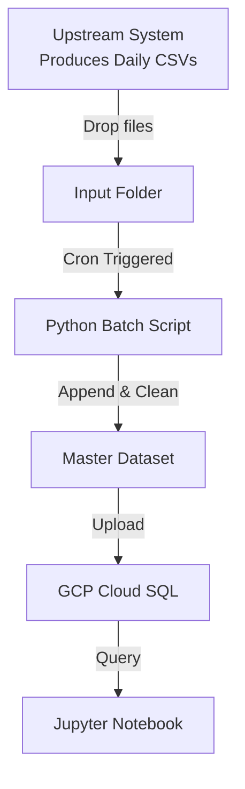
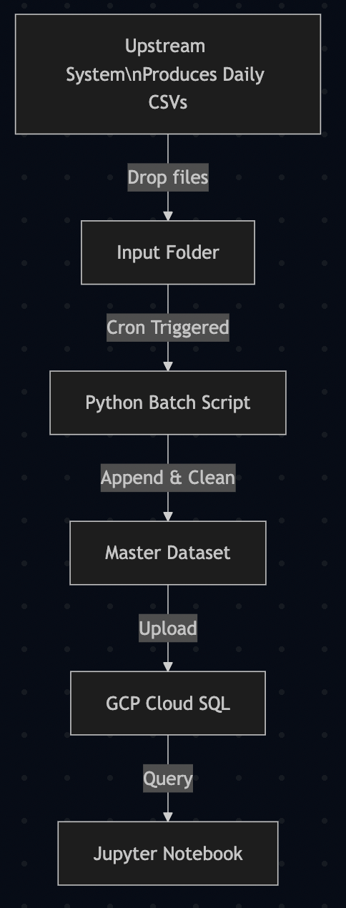

# Credit Default Analysis

<p align="right"><sub>転職用ポートフォリオ最適化版</sub></p>

## 📑 Table of Contents

- [Tech Stack & Tools](#️-tech-stack--tools)
- [Project Overview](#-project-overview)
- [Architecture & Data Flow](#-architecture--data-flow)
- [Part 1 – Data Ingestion (Batch Pipeline)](#part-1--data-ingestion-batch-pipeline)
- [Part 2 – Understanding the Data (EDA & Cleaning)](#part-2--understanding-the-data-eda--cleaning)
- [Future Work (Data Engineering Focus)](#-future-work-data-engineering-focus)


# Credit Default Analysis

## 🛠 Tech Stack & Tools

This project leverages a modern data engineering and analytics stack:

- **Python** — Core scripting and data pipeline logic
- **Pandas** — Data wrangling, cleaning, and transformation
- **Jupyter Notebook** — Interactive EDA, visualization, and documentation
- **Cron (Linux/macOS)** — Automated batch scheduling for ingestion
- **Google Cloud SQL (MySQL)** — Managed relational database for centralized, scalable storage
- **shutil, glob, os** — File system automation and orchestration
- **Matplotlib, Seaborn** — Data visualization (in notebook)

> **Why this stack?**
>
> - Demonstrates practical skills in batch data pipeline automation, cloud database integration, and reproducible analytics workflows.
> - Mirrors real-world DE/DS environments (Python, SQL, cloud, automation).
> - All code and infra are portable and can be adapted to other cloud or on-premise setups.

This project explores and models credit default risk using the **Give Me Some Credit** dataset from Kaggle.  
It demonstrates an end-to-end workflow covering:

- **Automated batch data ingestion (cron + Python)**
- **Data cleaning & validation**
- **Exploratory Data Analysis (EDA)**
- **Feature engineering foundations**

It is designed both as a **data science learning project** and as a **data-engineering–oriented pipeline** example.


# 🔭 Future Work (Data Engineering Focus)

To further demonstrate advanced data engineering skills and extend this project, consider the following enhancements:

- **Streaming Ingestion:** Upgrade the batch pipeline to support real-time data ingestion using Apache Kafka or Google Pub/Sub.
- **Orchestration:** Migrate cron-based scheduling to a workflow orchestrator (e.g., Apache Airflow, Cloud Composer) for better monitoring and dependency management.
- **Data Lake Integration:** Store raw and processed data in a cloud data lake (e.g., Google Cloud Storage, AWS S3) for scalable, cost-effective storage and versioning.
- **Automated Data Quality Checks:** Integrate tools like Great Expectations or custom validation scripts to ensure data integrity before loading to SQL.
- **CI/CD for Data Pipelines:** Implement automated testing and deployment for pipeline scripts using GitHub Actions or Cloud Build.
- **Advanced Analytics:** Expand EDA to include feature selection, model training, and automated reporting/notebook generation.
- **Monitoring & Alerting:** Add logging, monitoring, and alerting (e.g., Stackdriver, Prometheus) for pipeline health and data anomalies.
- **Infrastructure as Code:** Use Terraform or Deployment Manager to provision and manage cloud resources reproducibly.

> **These improvements will further showcase your readiness for modern data engineering roles and your ability to design robust, scalable, and production-grade data systems.**

---


# 🚀 Project Overview

The goal of this project is to:

1. Build a **maintainable batch ingestion pipeline** that consolidates daily credit data updates.
2. Store the processed dataset in **GCP Cloud SQL** so analysts and data scientists share an identical data source.
3. Perform **EDA and cleaning** to understand risk drivers related to loan delinquency.
4. Provide a foundation for future predictive modeling.

---

# 🏗️ Architecture & Data Flow

Below is the high-level architecture and data flow for the batch pipeline, designed to showcase practical data engineering skills:





**Key Steps:**
- **Automated Ingestion:** Cron job triggers Python script to process new files.
- **Data Consolidation:** All new data is appended to a master CSV.
- **Cloud Integration:** Data is uploaded to a managed SQL database for team access.
- **Analytics:** Data scientists/analysts use Jupyter for EDA and reporting.

> **This architecture demonstrates:**
> - Real-world batch pipeline orchestration
> - Cloud database integration
> - Reproducible, team-friendly analytics workflows
> - Automation and maintainability best practices

---

# Part 1 – Data Ingestion (Batch Pipeline)

## Goal

Automatically collect new CSV files, append them to a master dataset, and upload the consolidated data into **Cloud SQL (MySQL on GCP)**.

## File locations

- Data directory: `data/`
- Raw input folder (watched by the cron job): `data/input_folder/`
- Consolidated dataset: `data/sample_data.csv`
- Original snapshot: `data/sample_data_original.csv`
- Cron scripts & notebooks: `notebooks/`
  - `cron-upload-to-gcp.py`
  - `cronjob.txt`
  - `basic visualization.ipynb`

## Proposed flow

1. A **cron job** runs every day at **2:00 AM**.
2. It checks for new CSV files in `../data/input_folder/`.
3. New incoming files are produced by an upstream process.
4. `cron-upload-to-gcp.py`:
   - Reads all CSVs in the input folder.
   - Appends rows to the master dataframe.
   - Saves the dataframe as `sample_data.csv`.
   - Uploads the results to **Cloud SQL** (MySQL).
   - Deletes the input folder contents.
   - Recreates a clean folder for the next run.

## Cron setup

The crontab entry is documented in `notebooks/cronjob.txt`.

Example:

```bash
crontab -e
``` 
---

# Part 2 – Understanding the Data (EDA & Cleaning)

All EDA and cleaning logic is implemented in:

- `notebooks/basic visualization.ipynb`

---

## How to run locally

1. Start Jupyter:

```bash
jupyter notebook
``` 

2. Open: `notebooks/basic visualization.ipynb`  
3. Run the notebook step by step.

---

## Main steps in the notebook

### 1. Import raw CSV
- Load credit CSV files.
- Drop technical columns such as `Unnamed: 0`.

### 2. Initial exploration
- Inspect columns, shape, data types, and missing values.
- Create a simple data dictionary.
- Check duplicates.

### 3. Column name cleanup
- Normalize column names that contain symbols (e.g., `-`).

### 4. Missing values & outliers

Rules applied:

- **MonthlyIncome**  
  - Fill NaN with median  
  - Replace extreme outliers with median  

- **NumberOfDependents**  
  - Fill NaN with median  
  - Replace outliers  

- **Age**  
  - Replace ages below 22 with 22  

- **RevolvingUtilizationOfUnsecuredLines**  
  - Cap values above 1 at 1  

- **NumberOfTime30to59DaysPastDueNotWorse**  
  - Replace 96, 98 with median  

- **DebtRatio**  
  - Cap values at 1  

- **NumberOfOpenCreditLinesAndLoans**  
  - Cap values above 20  

- **NumberOfTimes90DaysLate**  
  - Replace 96, 98 with median  

- **NumberRealEstateLoansOrLines**  
  - Replace outliers with median  

- **NumberOfTime60to89DaysPastDueNotWorse**  
  - Replace 96, 98 with median  

---

## 5. Class imbalance

Target: `SeriousDlqin2yrs`  

Distribution:

- **93%** → No delinquency (`0`)
- **7%** → Delinquency (`1`)

EDA includes experiments with resampling to address imbalance.

---

## 6. Visualizations & correlations

- Correlation heatmaps (before & after cleaning)
- Feature distributions (Yes vs No on the target)
- Visualizations with outliers removed for clarity

---

## Key Findings (Summary)

- **Higher revolving utilization** strongly correlates with higher delinquency.
- **Younger customers** show higher delinquency rates.
- **NumberOfTimes90DaysLate > 1** is a strong risk signal.
- **More real-estate–backed loans** tends to correlate with *lower* delinquency risk.

---
